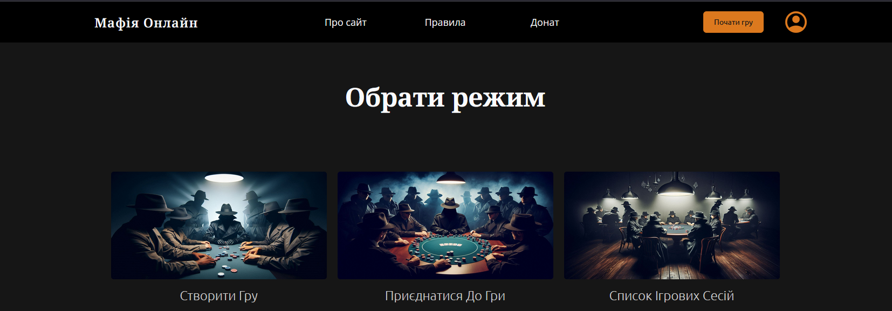

## 👋 Welcome

Hello ✋, my name is **Oleksandr Korlykhanov**.  
I am a student at **Ternopil National Technical University** 📚  

💻 I’m interested in **full-stack web development**.  
Currently, I’m studying **React.js, Node.js (NestJS, Next.js)** and improving my skills with Git.

📚 I’m also learning more about:
- Code architecture
- Design patterns
- Methodologies like **Agile** and its derivatives

---

## 🚀 Skills

### 🌐 Web Development
- HTML5
- CSS3
- JavaScript (JS)
- TypeScript (TS)
- React

## 🛠 Tools

- Git & GitHub  
- VS Code  
- npm / pnpm  
- Vite  
- ESLint & Prettier  
- Postman  
- Docker  

---

### 📝 Todo App

- 🔗 [Repository](https://github.com/Kapysta017/Mafia)
- ⚙️ Tech: React, Node.js, WebSocket
- 
<!--
**Oleksandr-Korlykhanov/Oleksandr-Korlykhanov** is a ✨ _special_ ✨ repository because its `README.md` (this file) appears on your GitHub profile.

Here are some ideas to get you started:

- 🔭 I’m currently working on ...
- 🌱 I’m currently learning ...
- 👯 I’m looking to collaborate on ...
- 🤔 I’m looking for help with ...
- 💬 Ask me about ...
- 📫 How to reach me: ...
- 😄 Pronouns: ...
- ⚡ Fun fact: ...
-->
